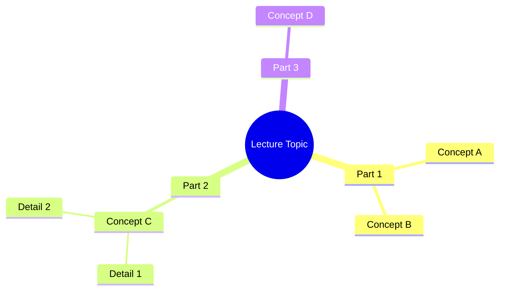
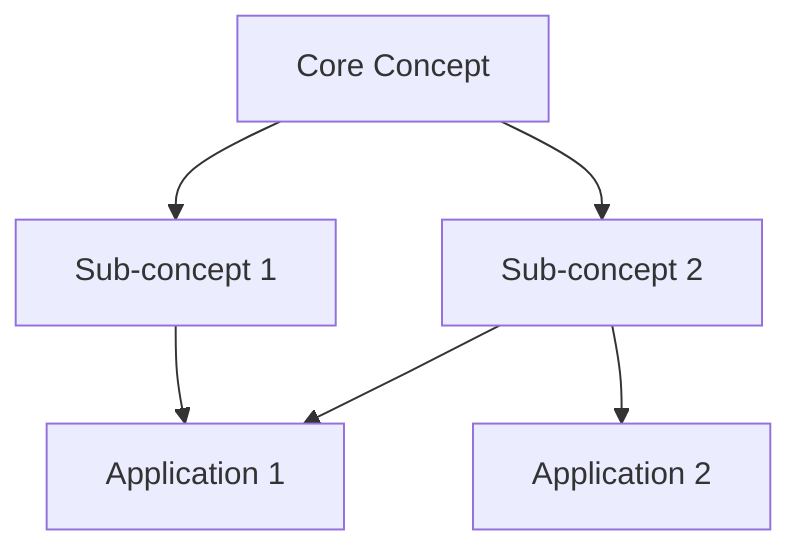
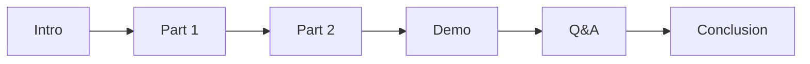

# Lecture Style Template

강의/프레젠테이션 콘텐츠 (예: YouTube 강의 트랜스크립트)를 위한 나노바나나 치트시트 템플릿

## 콘텐츠 특성

- 시간 순서대로 진행되는 내용
- 개념 설명 중심
- Q&A나 토론 포함 가능
- 데모/예시 포함

## Output Style 지침

```markdown
# Output Style: "Nano Banana" Cheat Sheet
Please adhere to the following formatting rules strictly:

1. **Visual Hierarchy & Structure**:
   - Use strict Markdown structure.
   - Use specific emojis for every section header to improve scanning.
   - Use **Bold** for key concepts and definitions.
   - Group by topic, not by timeline.

2. **Diagrams & Schematics (CRITICAL)**:
   - Use `mermaid` code blocks to visualize concepts.
   - Create a **Mind Map** for the overall topic structure.
   - Create **Flowcharts** for processes explained in the lecture.
   - Use **Class Diagrams** for concept relationships if applicable.

3. **Concept Tables**:
   - Key concepts in table format with definitions.
   - Compare/contrast tables for similar concepts.

4. **Quotable Insights**:
   - Extract memorable quotes or key insights.
   - Highlight "aha moments" from the lecture.
```

## Output Structure Plan

```markdown
## 1. Topic Overview (Mind Map)
- Create a Mermaid mindmap showing all major topics covered.

## 2. Key Concepts Matrix
| Concept | Definition | Example | Related To |
|---------|------------|---------|------------|

## 3. Core Ideas (Flowchart/Diagram)
- Visual representation of the main argument or process.

## 4. Notable Insights
- Blockquotes with the most impactful statements.

## 5. Practical Applications
- How to apply what was learned.

## 6. Summary & Takeaways
- 3-5 bullet points summarizing the lecture.
```

## 섹션별 Mermaid 예시

### Topic Mind Map 예시


### Concept Relationship 예시


### Timeline 예시 (선택적)


## 언어 지침

- 용어 및 고유명사: 영어 원문 유지
- 설명 및 필기 내용: 한국어로 작성
- 인용문: 원문 영어 + 한국어 의역 병기 가능
- 예: "LLM의 핵심 개념", "Transformer Architecture 이해"
