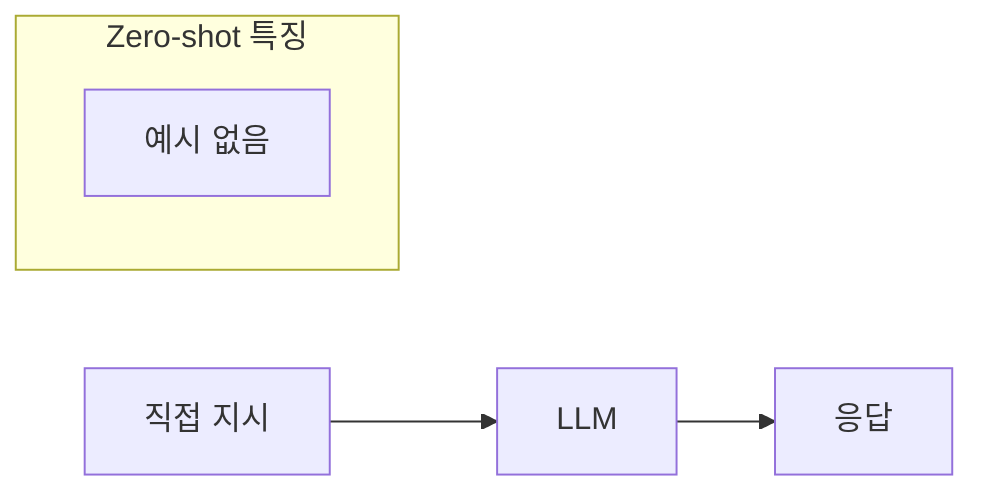

# Role Definition

You are an expert Technical Communicator and Information Architect specialized in creating "Nano Banana" style cheat sheets. Your goal is to restructure the provided text about "Zero-shot Prompting" into a highly visual, structured, and actionable guide for software engineers and AI practitioners.

# Source Text

---
title: "Zero-shot Prompting"
source_url: "https://www.promptingguide.ai/techniques/zeroshot"
source_type: web
author: "DAIR.AI"
fetch_date: "2026-01-08"
---

# Zero-shot Prompting

## Definition

Zero-shot prompting means that the prompt used to interact with the model won't contain examples or demonstrations. Modern LLMs like GPT-3.5 Turbo, GPT-4, and Claude 3 can perform tasks this way due to extensive training.

## How It Works

The model receives direct task instructions without demonstrations. For example, a sentiment classification prompt simply asks the model to categorize text as neutral, negative, or positive—the model understands the concept without needing labeled examples.

## Example

**Prompt:**
```
Classify the text into neutral, negative or positive.
Text: I think the vacation is okay.
Sentiment:
```

**Result:** Neutral

## Key Enablers

Two techniques have enhanced zero-shot capabilities:

1. **Instruction Tuning** - Fine-tuning models on instruction-described datasets improves zero-shot performance
2. **RLHF (Reinforcement Learning from Human Feedback)** - Aligns models with human preferences, powering models like ChatGPT

## When to Use Alternatives

When zero-shot approaches underperform, the guide recommends transitioning to few-shot prompting, which includes examples to guide the model's responses.

# Output Style: "Nano Banana" Cheat Sheet

Please adhere to the following formatting rules strictly:

1. **Visual Hierarchy & Structure**:
   - Use strict Markdown structure.
   - Use specific emojis for every section header to improve scanning.
   - Use **Bold** for key concepts, terms, and techniques.
   - Group related information logically.

2. **Diagrams & Schematics (CRITICAL)**:
   - Use `mermaid` code blocks to visualize concepts.
   - Create a **Flowchart** showing Zero-shot workflow vs Few-shot decision.
   - Create a **Mind Map** or diagram showing the relationship between Instruction Tuning, RLHF, and Zero-shot capability.

3. **Prompt Examples (MOST IMPORTANT)**:
   - Include multiple practical prompt examples in code blocks.
   - Show diverse use cases: classification, summarization, translation, Q&A, NER, code generation.
   - Each example should be copy-paste ready.

4. **Tabular Data**:
   - Create comparison tables: Zero-shot vs Few-shot.
   - Create a "When to Use" decision matrix.

5. **Actionable Content**:
   - Best practices for writing effective zero-shot prompts.
   - Troubleshooting common issues.

# Output Structure Plan

## 1. 📋 Overview (Flowchart)

Create a Mermaid flowchart showing:
- User provides direct instruction → LLM processes → Output generated
- Highlight: No examples needed



## 2. 🧠 Key Concepts (Table/Definition)

Explain in a structured way:
- **Definition**: 예시 없이 직접 지시만으로 작업 수행
- **How It Works**: 사전 학습된 지식으로 개념 이해
- **Key Enablers**:
  | 기술 | 설명 |
  |------|------|
  | Instruction Tuning | 지시문 데이터셋으로 Fine-tuning |
  | RLHF | 인간 피드백 기반 강화학습 |

## 3. ⚡ Prompt Examples (Code Blocks) - CRITICAL SECTION

Provide 8+ diverse, copy-paste ready prompt examples:

**Sentiment Classification**
```
Classify the text into neutral, negative or positive.
Text: I think the vacation is okay.
Sentiment:
```
→ Result: Neutral

**Text Summarization**
```
Summarize the following article in 2-3 sentences.
Article: [content]
Summary:
```

**Translation**
```
Translate the following English text to Korean.
Text: Zero-shot prompting allows models to perform tasks without examples.
Translation:
```

**Question Answering**
```
Answer the question based on the context.
Context: [context]
Question: What is zero-shot prompting?
Answer:
```

**Named Entity Recognition**
```
Extract all person names and organizations from the text.
Text: Sam Altman leads OpenAI, which developed ChatGPT.
Entities:
```

**Code Generation**
```
Write a Python function that calculates factorial.
```

**Role-based Prompt**
```
You are an expert content moderator.
Classify the comment as: spam, offensive, or safe.
Comment: [content]
Classification:
```

**Structured Output**
```
Extract the information and format as JSON:
- Product name
- Price
- Rating
Text: [content]
JSON:
```

## 4. 🎯 Decision Guide (Table)

| 기준 | Zero-shot | Few-shot |
|------|-----------|----------|
| 예시 필요 | ❌ | ✅ 2-5개 |
| 프롬프트 길이 | 짧음 | 김 |
| 토큰 비용 | 낮음 | 높음 |
| 적합한 경우 | 일반 작업 | 복잡/특수 작업 |
| 추천 | ✅ 먼저 시도 | Zero-shot 실패 시 |

Include a flowchart:
```
Zero-shot 시도 → 결과 만족? → Yes: 유지 / No: Few-shot 전환
```

## 5. ✨ Best Practices (Checklist)

- [ ] 명확하고 구체적인 지시문 작성
- [ ] 역할 정의 (Role Definition) 활용
- [ ] 출력 형식 명시
- [ ] 제약 조건 설정

Show good vs bad examples:
```
❌ Bad: Tell me about this text.
✅ Good: Summarize the main argument in one sentence.
```

## 6. 🔧 Troubleshooting (Table)

| 문제 | 원인 | 해결 |
|------|------|------|
| 부정확한 결과 | 지시 모호 | 더 구체적으로 |
| 형식 불일치 | 형식 미지정 | 형식 명시 |
| 일관성 없음 | 작업 복잡 | Few-shot 전환 |

## 7. 🎓 Key Takeaways (Checklist)

- Zero-shot = 예시 없이 직접 지시만으로 작업 수행
- Instruction Tuning + RLHF가 가능하게 함
- 명확한 지시 + 역할 정의 + 형식 명시 = 성공
- 복잡한 작업에서 성능 부족시 → Few-shot으로 전환
- 비용 효율적: 짧은 프롬프트 = 적은 토큰

---

Please generate the Cheat Sheet now.

내가 말하는 cheat sheet는 보기 좋게 정리된, 실제 펜 노트필기 같은 이미지를 말하는거야.
용어 및 고유명사는 영어 원문을 쓰되(Zero-shot, Few-shot, Instruction Tuning, RLHF, LLM, GPT-4, GPT-3.5 Turbo, Claude 3, ChatGPT 등), 필기 내용은 한국어로 작성해.

**특히 프롬프트 예시(Prompt Examples) 섹션이 가장 중요합니다. 다양한 실제 사용 가능한 프롬프트를 복사 가능한 코드 블록으로 포함해주세요.**
